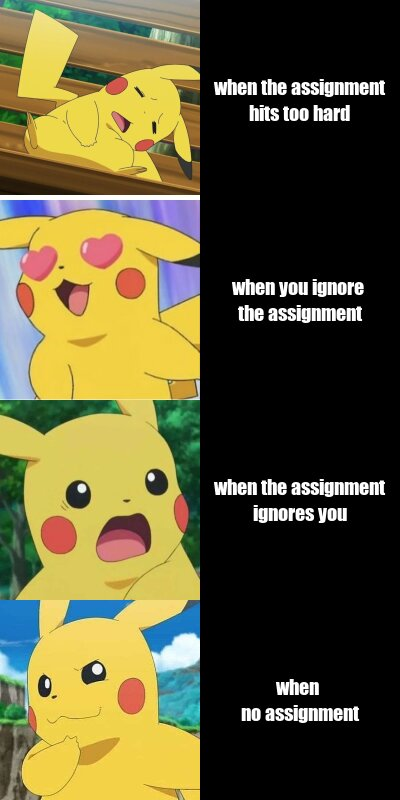
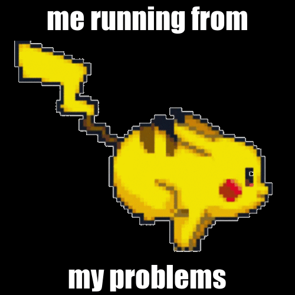

```{r setup, include=FALSE, cache=FALSE}
knitr::opts_chunk$set(echo = TRUE, message = FALSE, warning = FALSE)
```

## My meme

My motivation for my meme was a typical meme format of a reaction image and some text - I made it original by adding Pikachu! (I don't tend to see many memes with Pikachu in it, apart from the very popular "Shocked Pikachu" meme.) I thought it would be nice to fill the pikachu sized hole in the meme community :)



```{r file = 'meme1.R', eval = FALSE}
```

## my animation

This is my animation! I don't believe I copied it off of any specific template (but I could be wrong - such is the work of subliminal messaging or something. Subliminal meme-ing? Not quite sure that's right lol). "Running away from problems" does seem to be a meme-like saying, so I went with it (especially because it's such a cute pikachu running animation in the first place!).  I wanted to add more ~~creativity~~, so I flipped the gif (in more ways than one). 



```{r file='animation2.R', eval=FALSE}
```

```{css, inclue=FALSE}
body {
background-color: #5499C7
}
metadata {
background-color:#F9E79F
}
p {
font-size: 18px;
color: #F9E79F;
text-align: center
}
h1{
text-align: center;
background-color: #F9E79F;
color: #5499C7;
padding: 20px;
margin: 20px
}
h2 {color: white;
text-align: center
}
```
